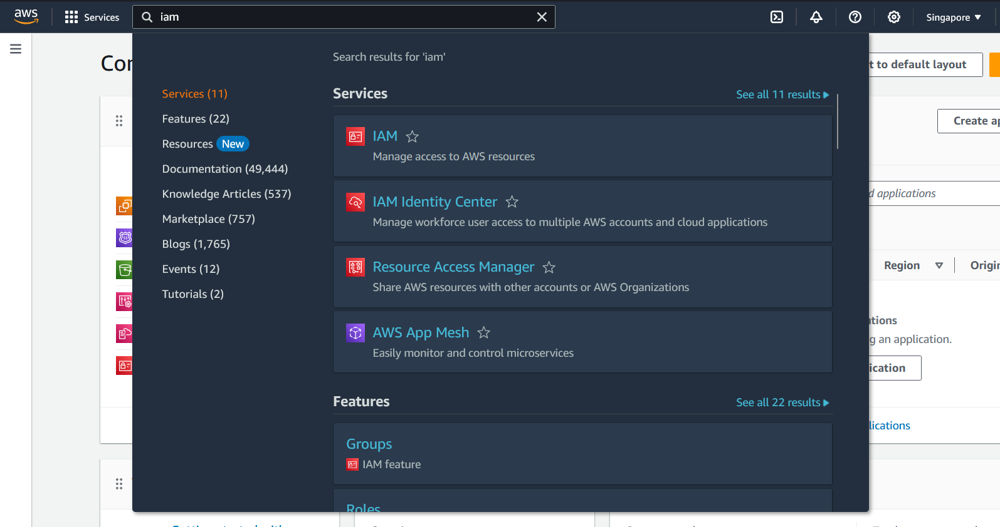
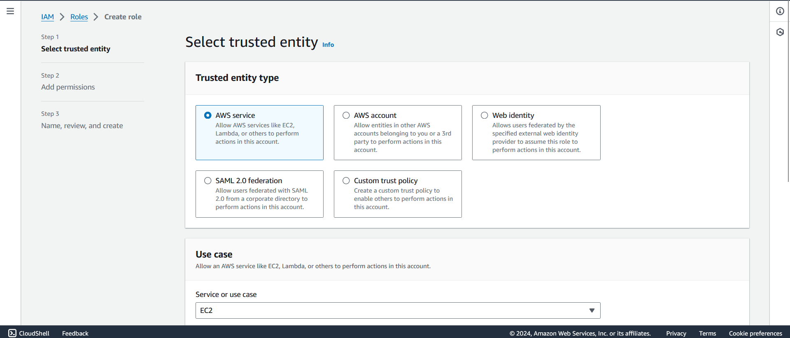

# Collect-Metrics-and-Logs-by-Using-the-CloudWatch-Agent

## Attach an IAM role for CloudWatch to an EC2 instance

-	In the AWS Management Console, type IAM into the search box, and then select the `IAM` service. 
-	In the navigation pane, in Access management, select `Roles`.
-	Select `Create role`.
-	In Service or use case, select `EC2`, and then select Next.

-	On the Add permissions page, in Permissions policies, search for `CloudWatchAgentServerPolicy`, and then select the `CloudWatchAgentServerPolicy` check box.

sudo /opt/aws/amazon-cloudwatch-agent/bin/amazon-cloudwatch-agent-config-wizard

