- Go to `AWS Compute Optimizer` from AWS Console

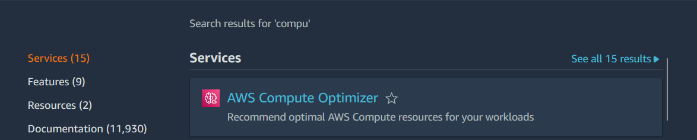

- Select `EC2 instances`

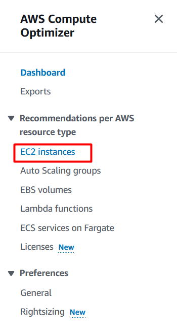

- You will see a list of EC2 instances like this, 

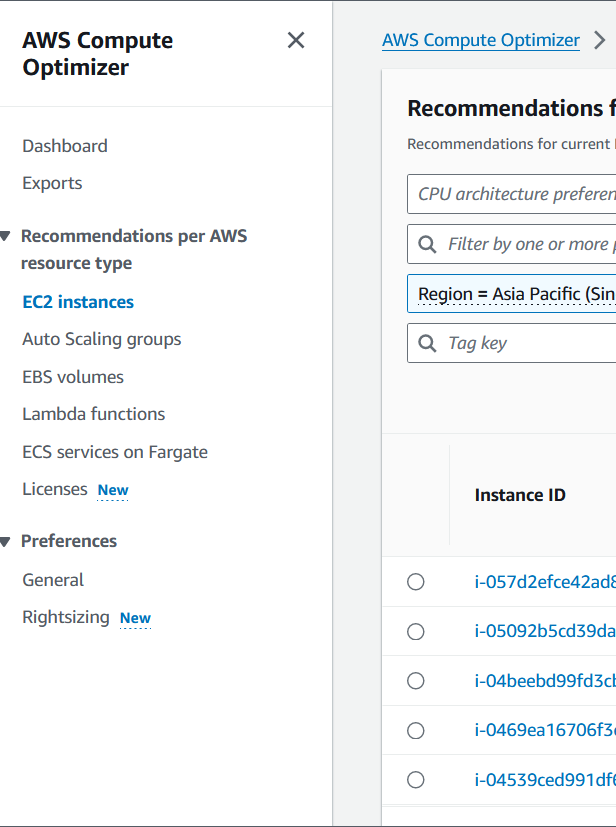

- Click on the `filter by one or more properties searchbox`, and select `"Findings"` to select `"Over-provisioned"`

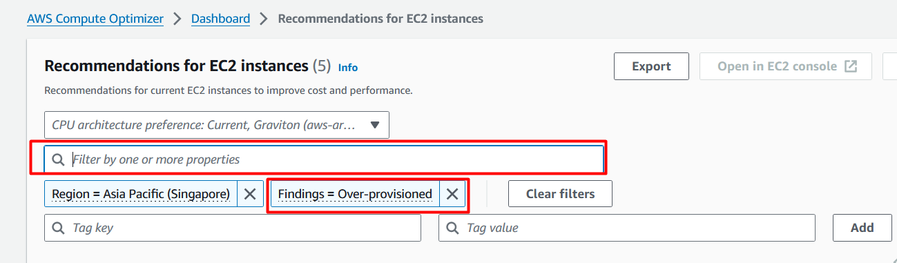

- You will see a list of instances with CPU over-provisioned like this

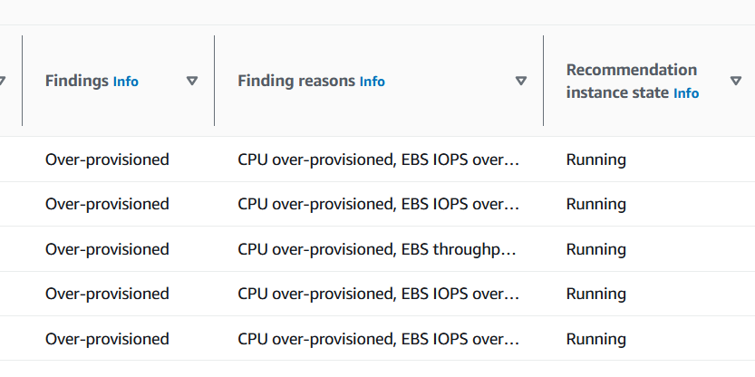

- Select EC2 and click `View Details`

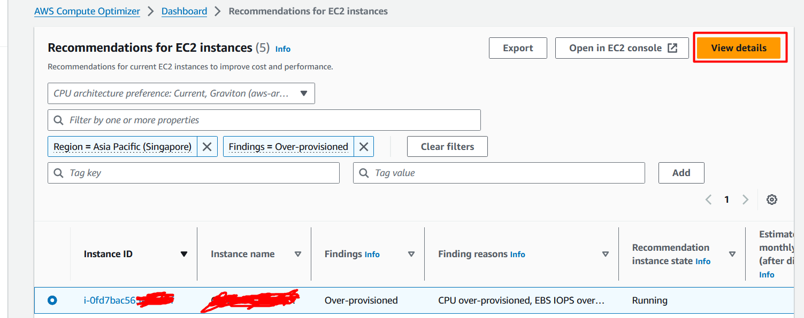

- You will see three Options to choose and Select the option which has most saving on hourly price.

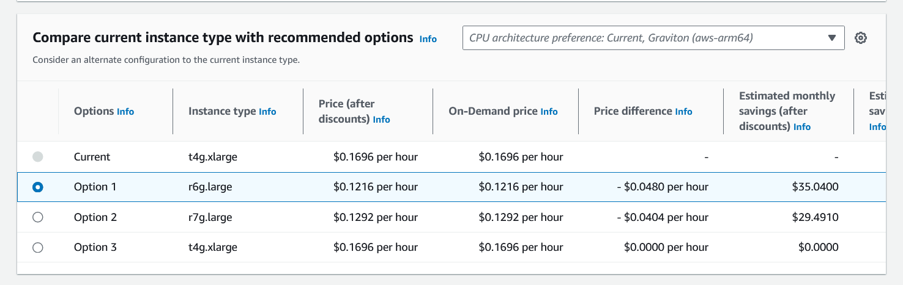

- Go to `EC2` from AWS Management Console select the instance and ensure it is the one you were targeting in Compute Optimizer

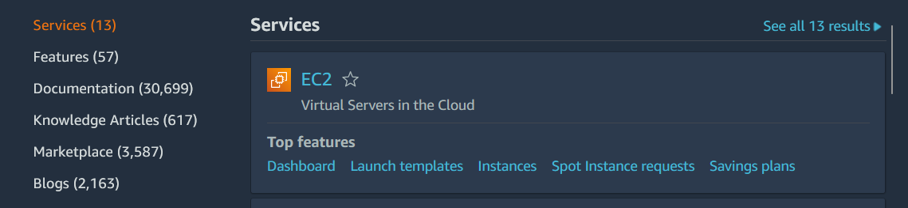

- You will see it here too. It is `Over-provisioned`

- Click on `Instance state` and select `Stop instance`

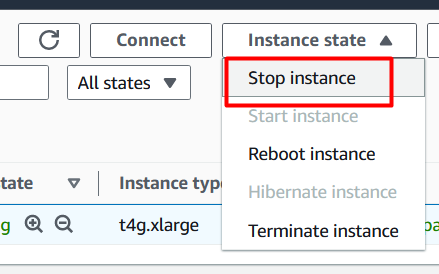

- Click `Stop`

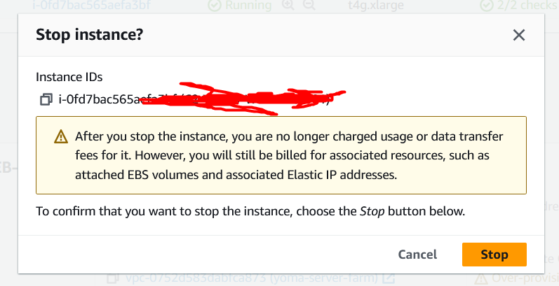

- Change the instance type clicking on `Actions`, `Instance settings`and `Change instance type`

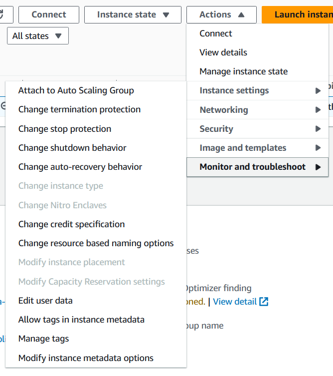

- Select new instance which is recommended by `Compute Optimizer` and click `Apply`

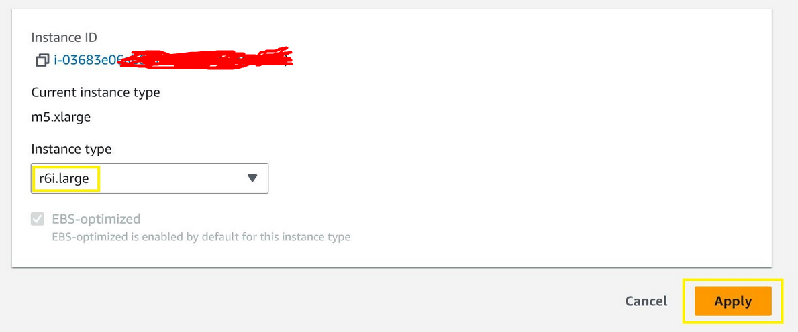

- Click on `Instance state` and select `Start instance`

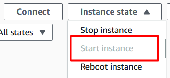

---

> [!CAUTION]
> AWS recommends to take backups of EC2 before changing instance types and make sure to check with vendor to ensure compatibility and supportability before migrating your instances.

> [!NOTE]
> You can always manually change the instance back to its original type. 

> [!IMPORTANT]
> Check cost by using Cost Explorer or the Cost and Usage Report (CUR). Cost Explorer and CUR billing data are delayed by ~48hours, after ~2days you will be able to visualize the savings. 

---

## **Resources & Next Steps**

*   **📦 Full Code Repository:** [AWS Learning Labs](https://github.com/thukhakyawe/aws-learning-labs) - Get the complete, working code from this post
*   **📖 More Deep Dives:** [Whispering Cloud Insights](https://thukhakyawe.hashnode.dev/) - Read other technical articles
*   **💬 Join Discussion:** [DEV Community](https://dev.to/thukhakyawe_cloud) - Share your thoughts and questions
*   **💼 Let's Connect:** [Linkedin](www.linkedin.com/in/thukhakyawe/) - I'd love to connect with you

---