## 1. Create EC2 for Amazon Linux

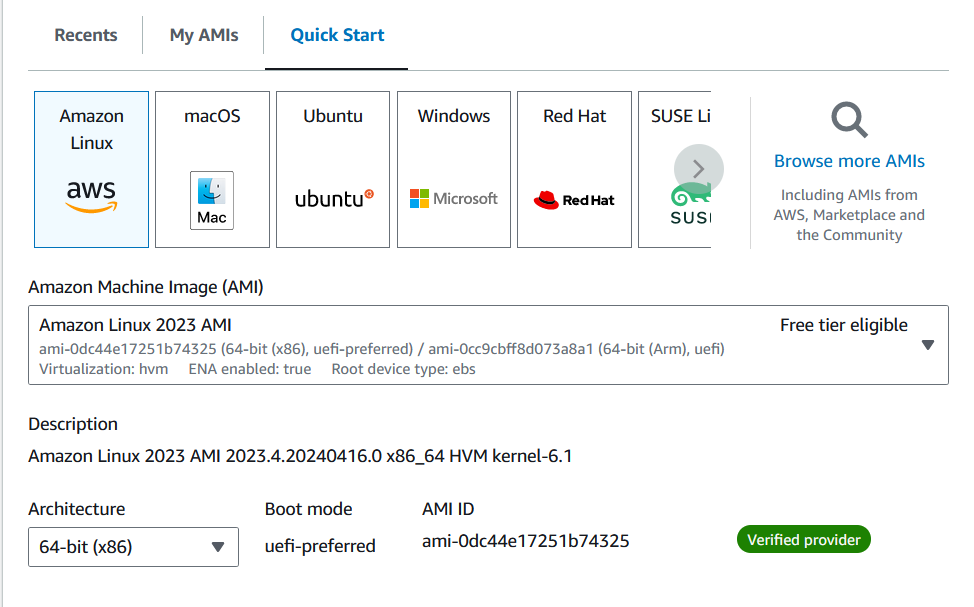

## 2. Create Cloudwatch Alarm

- In the AWS Management Console, type `cloudwatch` into the search box, and then select the `CloudWatch` service.

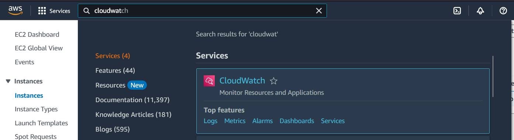

- Click `All alarms`

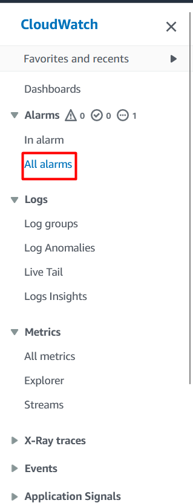

- Click `Create alarm`

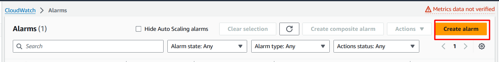

- Click `Select metric` 

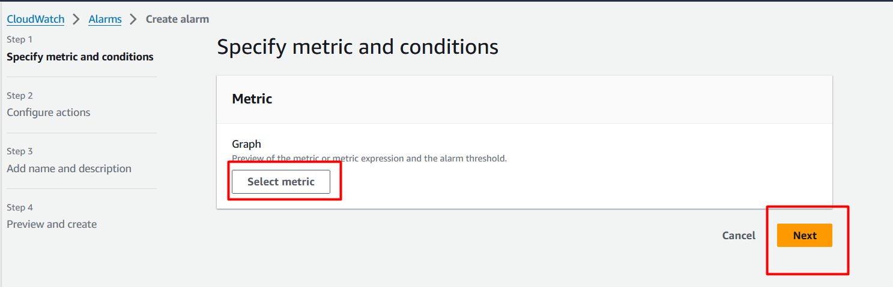

- Click `EC2`

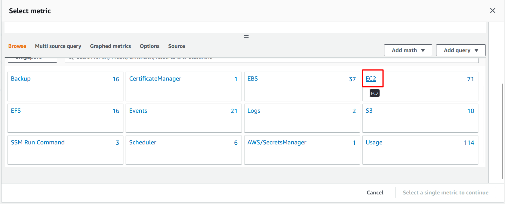

- Click `Per-Instance Metrics`

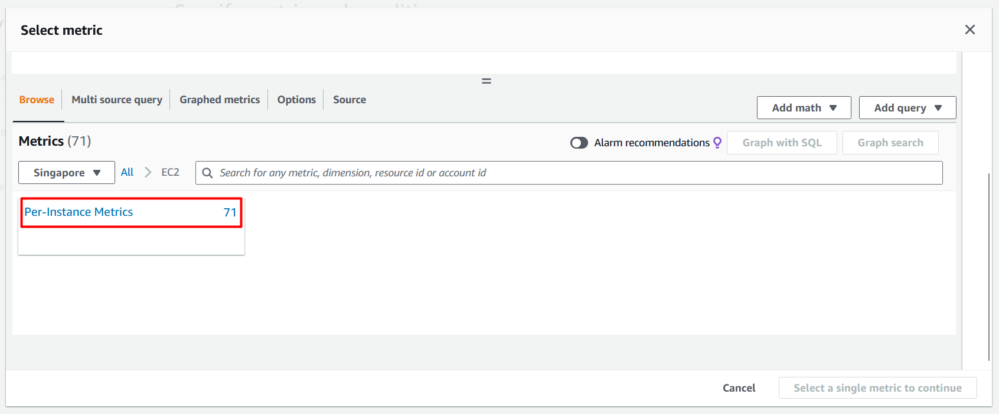

- Select `Cloudwatch Lab` and click `Create alarm`


- Set Period based on your need

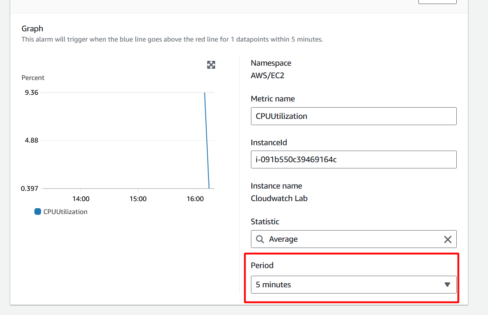

- Select `Greater/Equal` and Write `80` and then Click `Next`

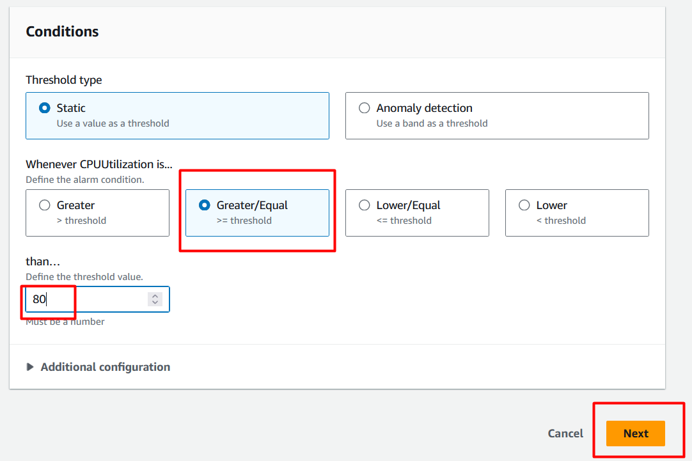

- Select `Create new topic` , Write topic name and your email then click `Next`

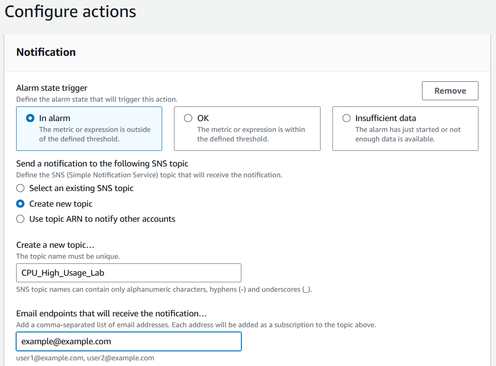

- Write `CPU High Usage Alert` and click `Next` then click `Create alarm`

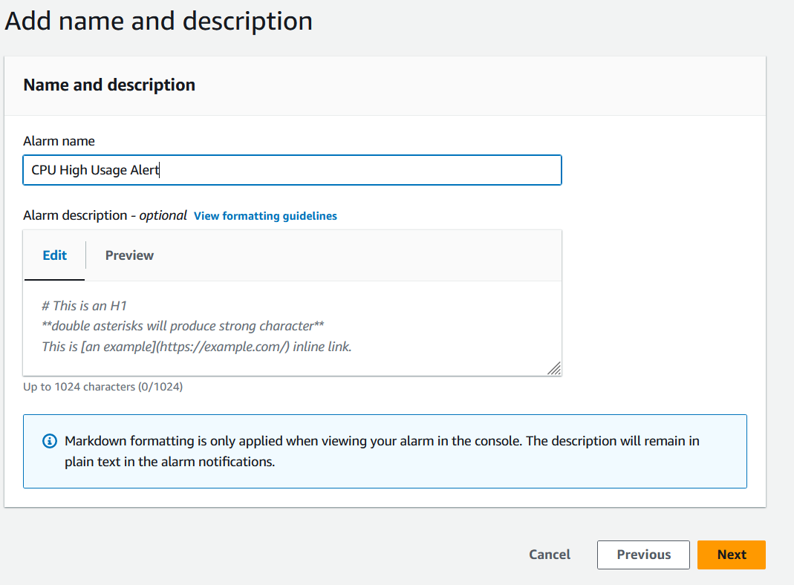

## 3. Install stress application at EC2

- In the AWS Management Console, type `EC2` into the search box, and then select the `EC2` service.
•	On the Instances page, select the `Cloudwatch lab` check box, and then select `Connect`.

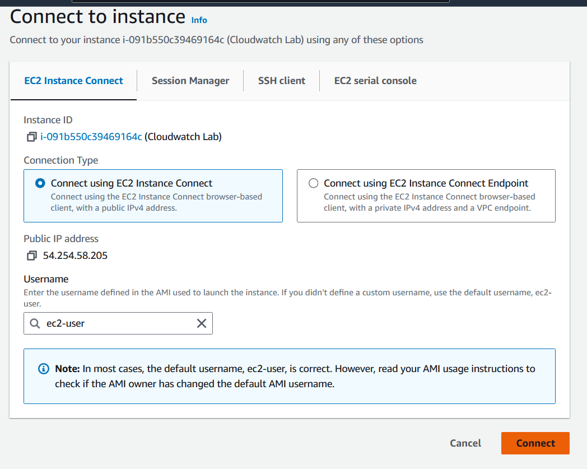

- To install the Stress Application

``` sudo yum install stress -y ```

``` sudo stress --cpu 4 ```

## 4. Monitor the CPU High Usage Alert alarm for the WebServer EC2 instance ##

- In the AWS Management Console, type `EC2` into the search box, and then select the `EC2` service.


- Select `Cloudwatch lab` and `Monitoring`

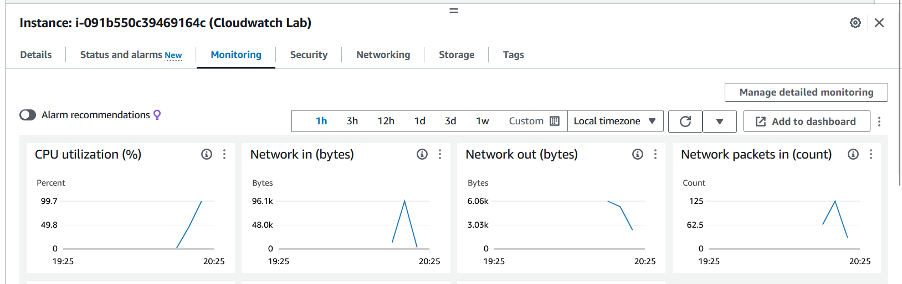

## 5. Check CPU High Usage Alert ##

- In the AWS Management Console, type `Cloudwatch` into the search box, and then select the `CloudWatch` service.

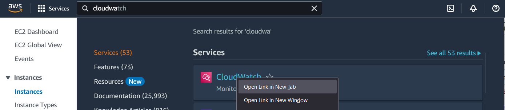

- Click `All alarms`

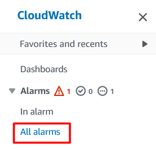

- You will see alarm is `in alarm` state

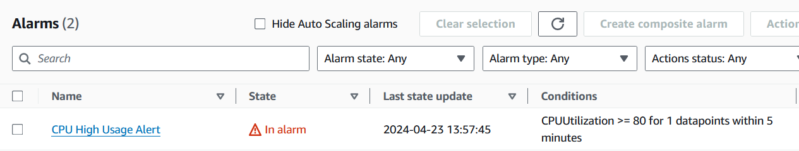

--------------------------
***That it is. Congratulations, you have completed Lab-How To Create a CloudWatch Alarm for CPU Utilization***

--------------------------