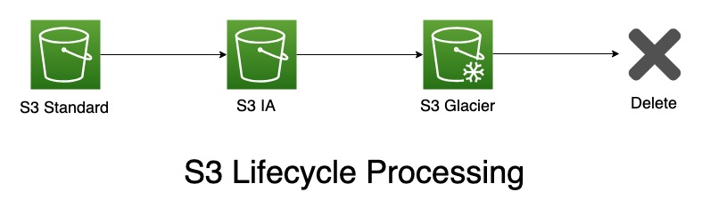

## 1. Create an S3 bucket ##

- Click `Create bucket`

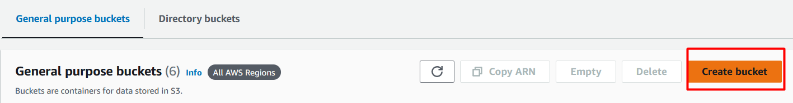

- Set Bucket Name as Unique Name

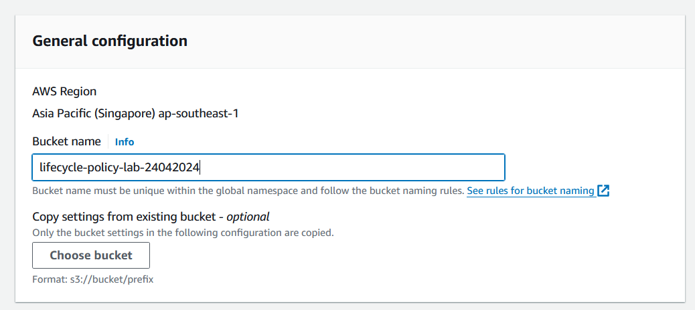

- Click `Create bucket`

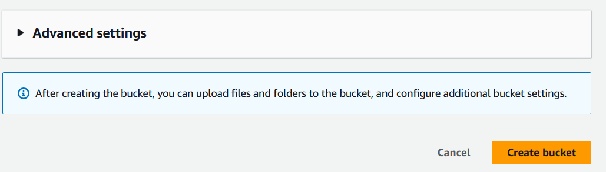

- Click `Upload`

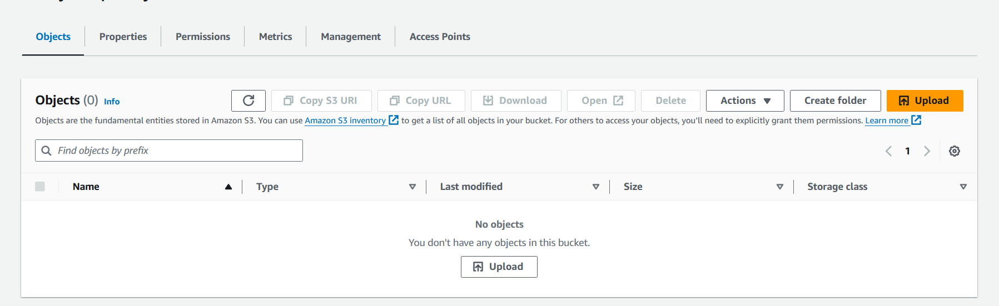

- Click `Add files`

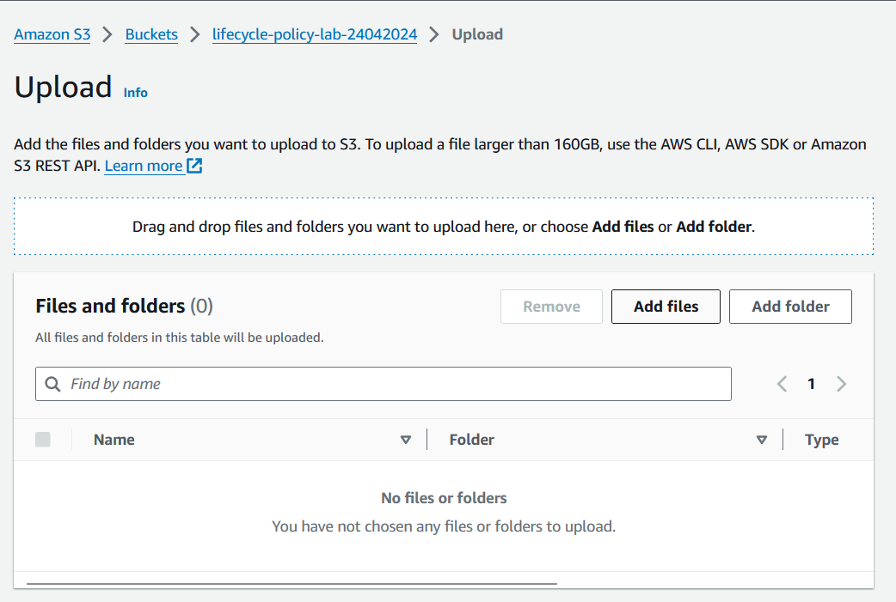

- Choose `Your File` and Click `Upload`

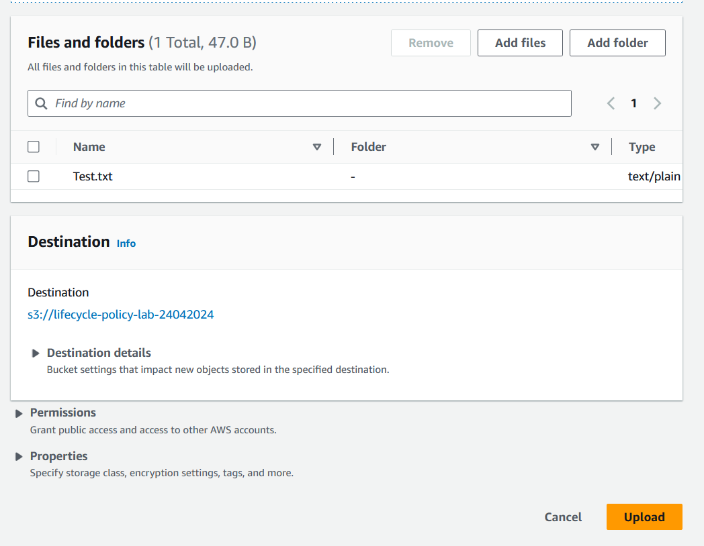

- Click `Test.txt`

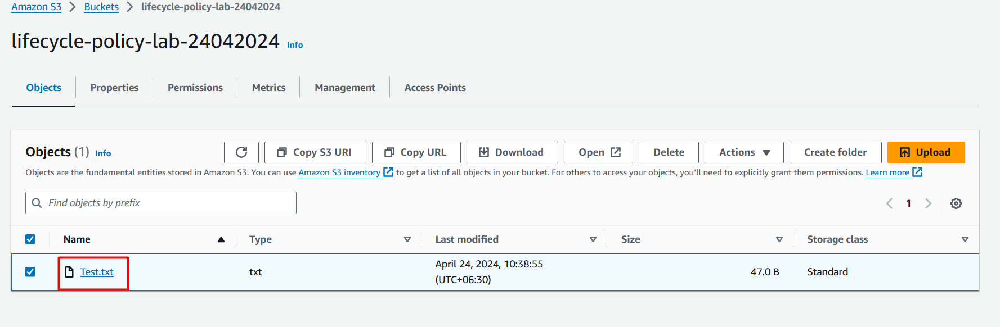

- Check at `Storage class`

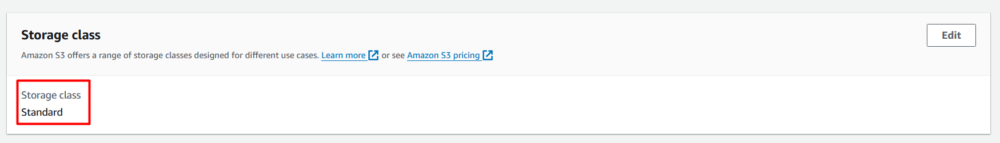

- Click `Your bucket name`

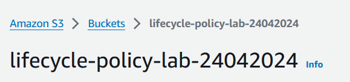

- Click `Managment` and `Create lifecycle rule`

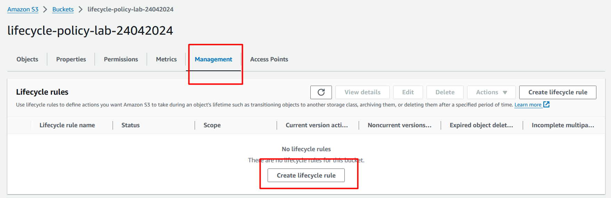

- Write `lifecycyle-rule` at Lifecycle rule name
- Select `Apply to all objects in the bucket`
- Click `I acknowledge that this rule will apply to all objects in the bucket.`

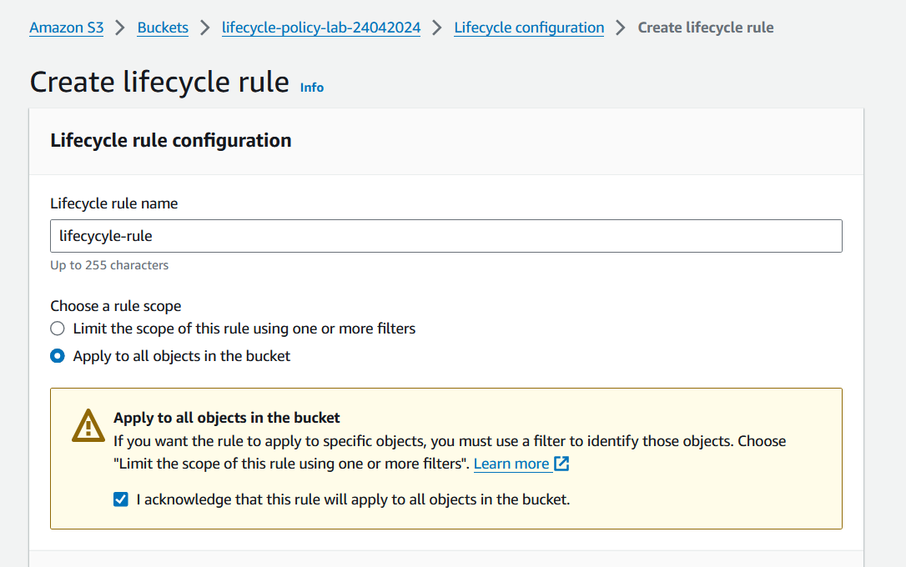

- Select `Lifecycle rule actions`like this and choose `Choose storage class transitions`and write `Days after object creation` at `Transition current versions of objects between storage classes`

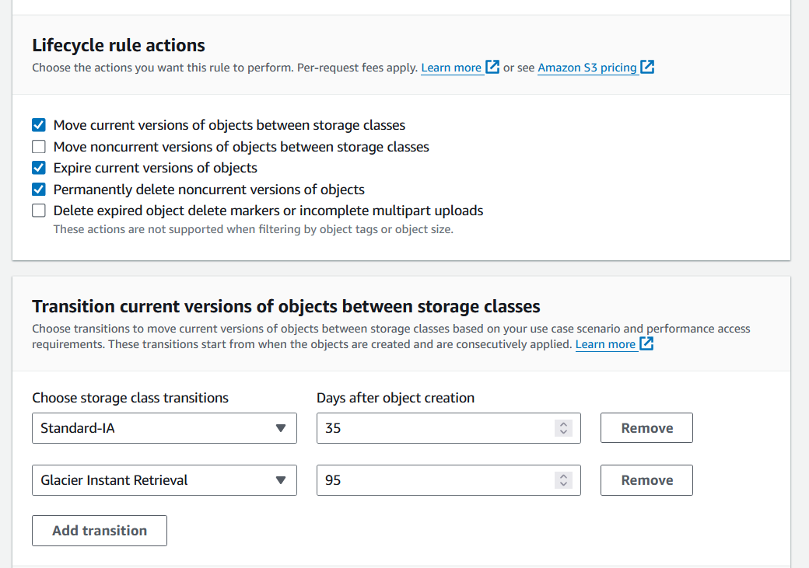

- Write `days` at `Days after object creation` and `Permanently delete noncurrent versions of objects `

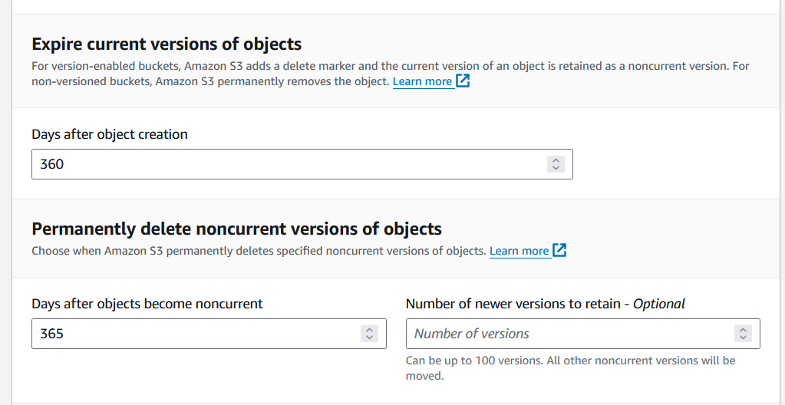

- Click `Create rule`

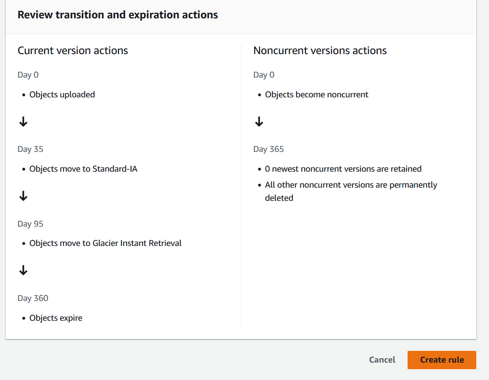

-----------------
***That it is. Congratulations, you have completed Lab-How To Create an Object Lifecycle Policy for Amazon S3***

-----------------
