## 1. Create VPC, Subnets, Route tables ##

- Create VPC

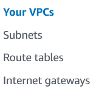

- Create Two EC2

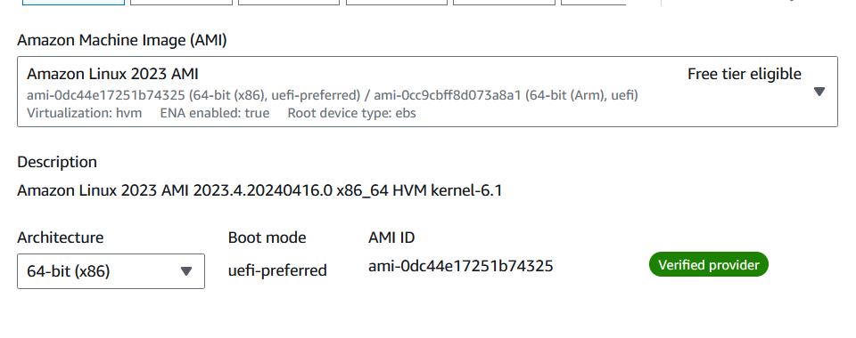

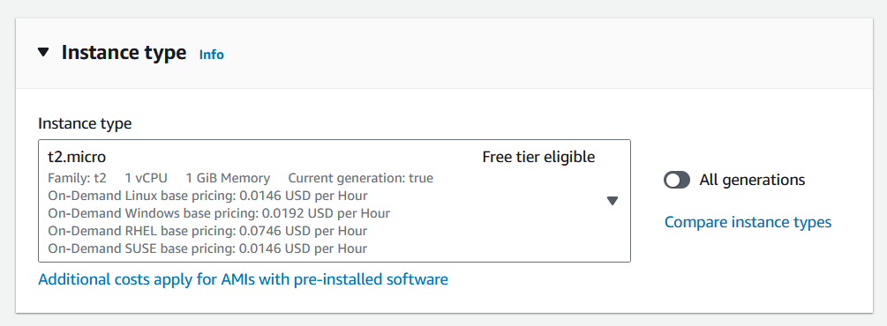

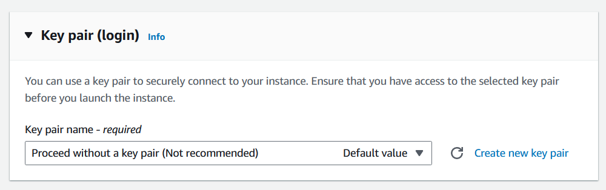

- Use your VPC, Public Subnet, Security Group and add User-Data by using User-Data's information

- Click `Launch Instances`

- Create for Second Lab Server too

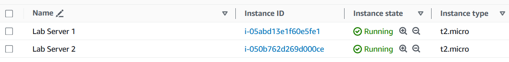

## 2. Create an application load balancer for EC2 ##

- Click `Load Balancers`

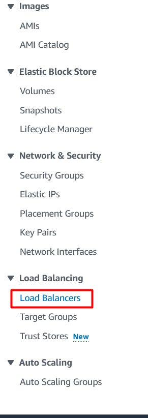

- Click `Create load balancer`

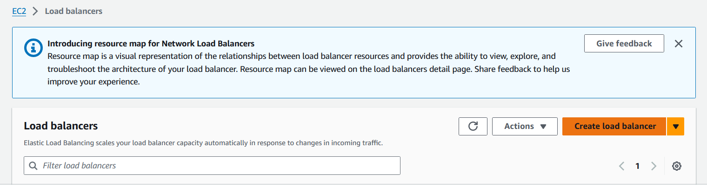

- Click `Create` of Application Load Balancer 

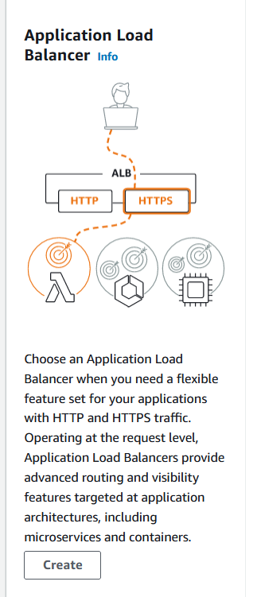

- Write ALB Name

- Select your vpc and choose public subnets and security group

- Click `Create target group`

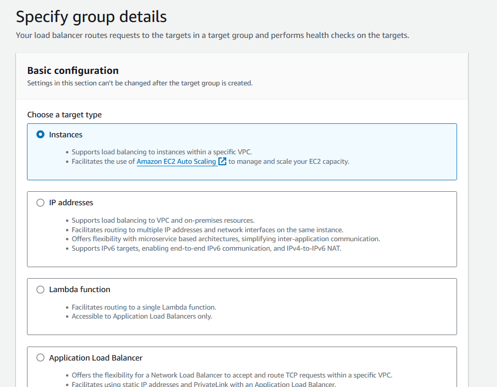

- Write Name and click `Next`

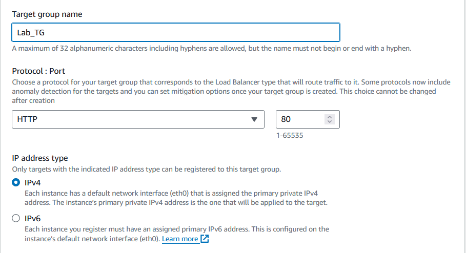

- Click both EC2 and  `Include as pending below`

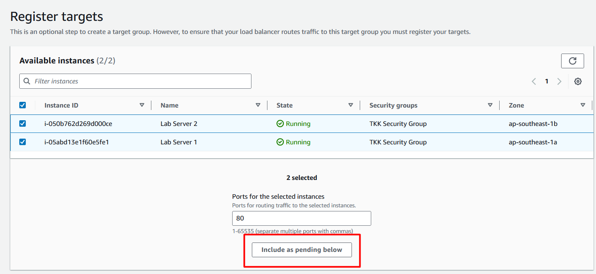

- Click `Create target group`

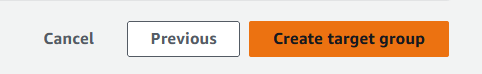

- Back to previous tab and choose your target group

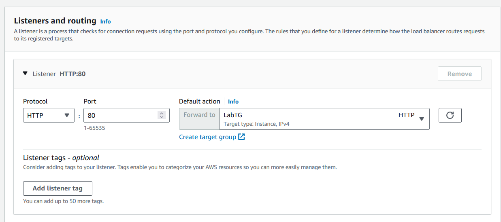

- Click `Create load balancer`

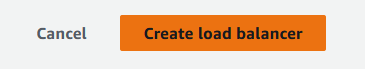

## 3. Implement the Web Application Firewall (WAF) ##

- Go to `WAF` from AWS Management Console

- Click `Create web ACL`

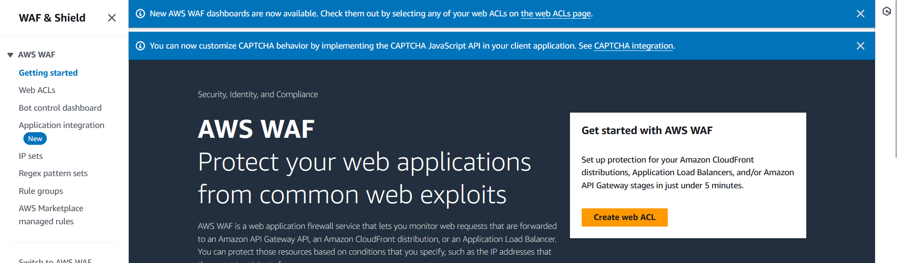

- Choose `Singapore` at Region and write name

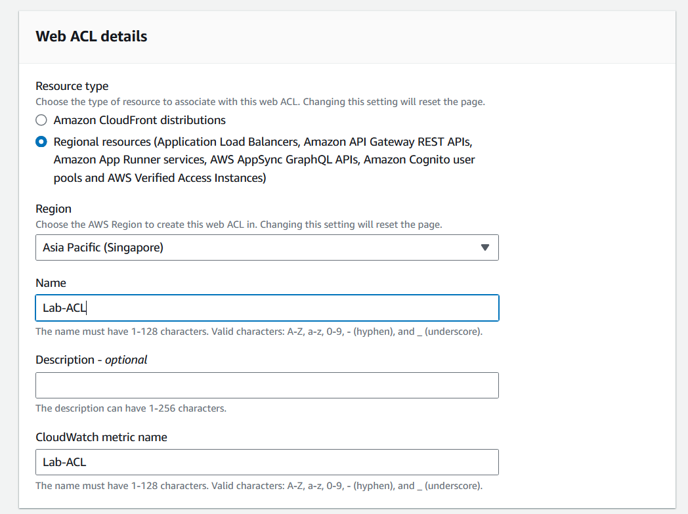

- Click `Add AWS resources`

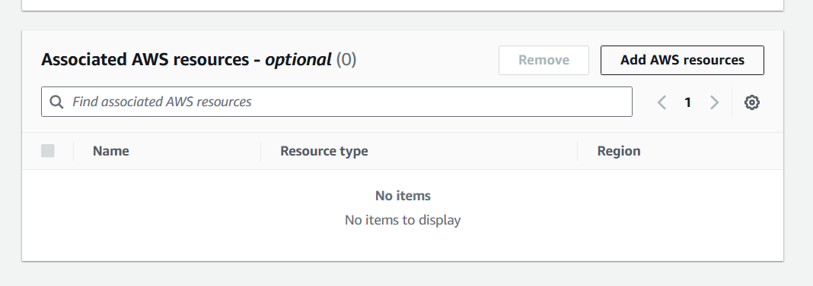

- Select `Application Load Balancer` and `LabLB` then Click `Add`

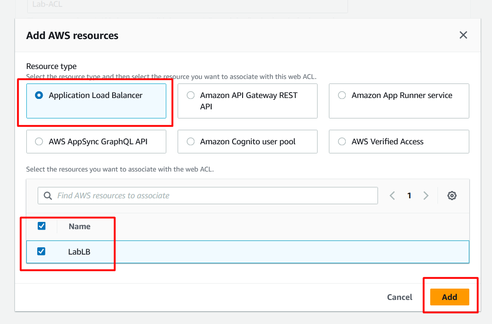

- Click `Next`

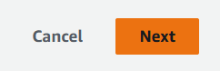

- Click `Add rules` and `Add managed rule groups`

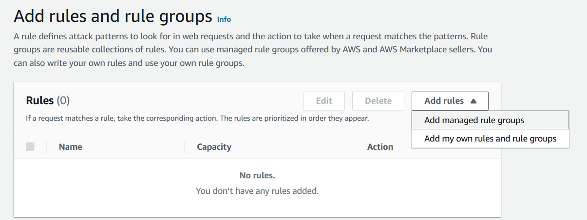

- Click `AWS managed rule groups`

- Select `Core rule set` and `SQL database` at `Free rule groups`

- Click `Add rules`

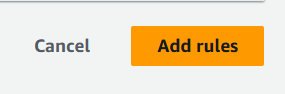

- Click `Next`

- Click `Next`

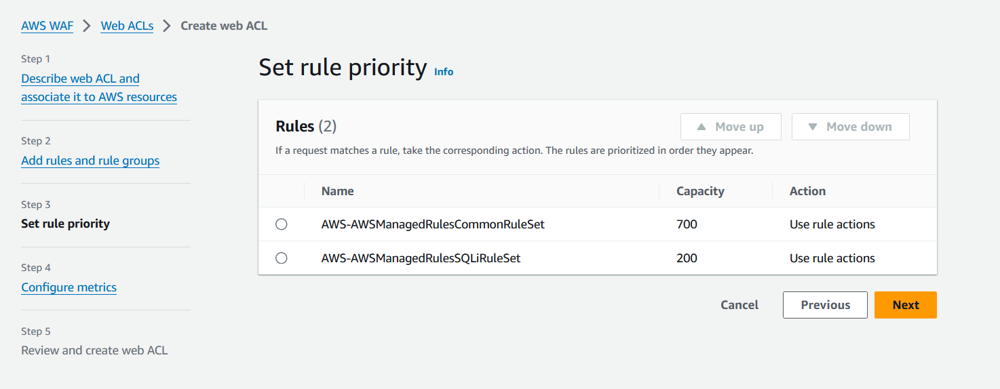

- Click `Next`

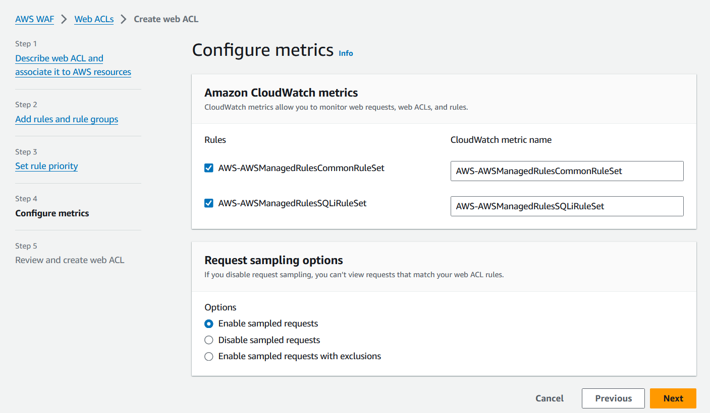

- Click `Create web ACL`

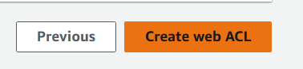

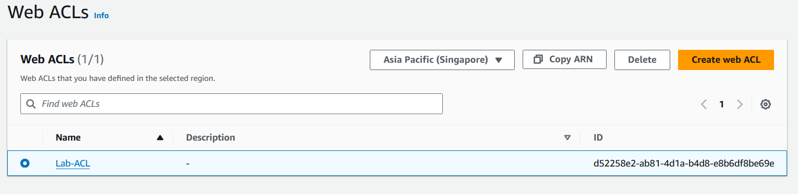

---

**Status:** Complete ✅

Congratulations on successfully completing this.

---

### **Related Resources**

*   **Lab Repository:** [AWS Learning Labs](https://github.com/thukhakyawe/aws-learning-labs)
*   **Technical Blog:** [Whispering Cloud Insights](https://thukhakyawe.hashnode.dev/)
*   **DEV Community:** [Thu Kha Kyawe](https://dev.to/thukhakyawe_cloud)

---