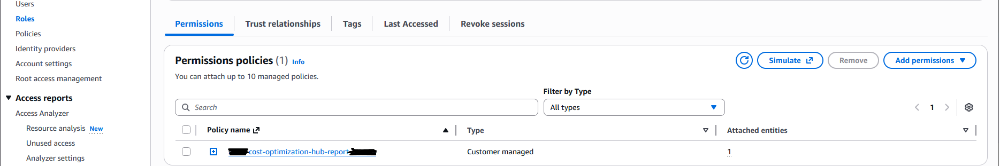

# AWS Cost Optimization Hub Reporting Automation

This solution automates the extraction of AWS Cost Optimization Hub recommendations using AWS Lambda and stores them in Amazon S3 for further analysis and reporting.

Architecture

- AWS Cost Optimization Hub: Source of cost optimization recommendations

- AWS Lambda: Processing engine for data extraction and transformation

- Amazon S3: Secure storage for generated CSV reports

- IAM Roles & Policies: Secure access control and permissions management

Prerequisites

- AWS Account with appropriate permissions

- Access to AWS Cost Optimization Hub

- Basic understanding of AWS services (IAM, Lambda, S3)

Implementation Steps

## Step 1: Create S3 Bucket

Create an Amazon S3 bucket to store the generated cost optimization reports.

Steps:

- Navigate to Amazon S3 in AWS Management Console

- Click "Create bucket"

- Enter a descriptive bucket name (e.g., company-cost-optimization-reports)

- Select the appropriate AWS region

- Complete bucket creation


## Step 2: Create IAM Policy

Create an IAM policy that grants necessary permissions for the Lambda function to access Cost Optimization Hub and write to S3.

Required Permissions:

- Cost Explorer read access

- Cost Optimization Hub list recommendations

- S3 put object permissions

- CloudWatch Logs for monitoring and debugging

- Note: You must replace S3 bucket name with yours.

```
{
    "Version": "2012-10-17",
    "Statement": [
        {
            "Effect": "Allow",
            "Action": [
                "ce:GetCostAndUsage",
                "ce:GetCostForecast",
                "ce:GetSavingsPlansPurchaseRecommendation",
                "ce:GetReservationPurchaseRecommendation",
                "cost-optimization-hub:ListRecommendations",
                "cost-optimization-hub:GetPreferences"
            ],
            "Resource": "*"
        },
        {
            "Effect": "Allow",
            "Action": [
                "s3:PutObject",
                "s3:PutObjectAcl"
            ],
            "Resource": "arn:aws:s3:::tkk-cost-optimization-hub-report/*"
        },
        {
            "Effect": "Allow",
            "Action": [
                "logs:CreateLogGroup",
                "logs:CreateLogStream",
                "logs:PutLogEvents"
            ],
            "Resource": "arn:aws:logs:*:*:*"
        }
    ]
}
```


## Step 3: Create IAM Role

Create an IAM role for the Lambda function with the previously created policy.

Steps:

- Navigate to IAM > Roles in AWS Console

- Click "Create role"

- Select "AWS service" as trusted entity

- Choose "Lambda" as use case

- Attach the policy created in Step 2

- Provide a descriptive role name and complete creation



## Step 4: Create Lambda Function

Deploy the Lambda function that will generate and export the cost optimization reports.

Configuration:

- Runtime: Python 3.x

- Execution role: Use the IAM role created in Step 3

- Timeout: Set appropriate timeout (recommended: 5-10 minutes)

- Memory: Allocate sufficient memory (recommended: 512MB-1024MB)


- Use this lambda_function.py. Note you must update with your bucket name and bucket region in this code.

```
import boto3
import io
import csv
import datetime

# --- CONFIGURATION ---
# !!! UPDATE THIS BUCKET NAME !!!
DESTINATION_BUCKET = "tkk-cost-optimization-hub-report"
# ---------------------

def format_tags(tags_list):
    """
    Helper function to convert the AWS tag list
    (e.g., [{'key': 'Name', 'value': 'my-db'}])
    into a simple string (e.g., "Name=my-db").
    """
    if not tags_list:
        return ""
    # You can change the separator. A pipe "|" is common.
    return "|".join([f"{tag['key']}={tag['value']}" for tag in tags_list])

def lambda_handler(event, context):
    
    # Initialize the clients
    # Cost Optimization Hub is a global service, but the API endpoint is in us-east-1
    client = boto3.client('cost-optimization-hub', region_name='us-east-1')
    
    # S3 client explicitly pointing to your region (ap-southeast-1)
    s3_client = boto3.client('s3', region_name='ap-southeast-1')
    
    # Create an in-memory text file
    csv_output = io.StringIO()
    
    # Use a standard csv.writer
    writer = csv.writer(csv_output)
    
    # --- NEW: Define your desired CSV headers (friendly names) ---
    # This is the exact order they will appear in the CSV
    friendly_headers = [
        'Account name and ID', 
        'Region',
        'Resource ID',
        'Resource type',
        'Top recommended action',
        'Implementation effort',
        'Is resource restart needed',
        'Is rollback possible',
        'Estimated monthly savings',
        'Estimated monthly cost',
        'Estimated savings percentage',
        'Current resource summary',
        'Recommended resource summary',
        'Tags',
        'Recommendation ID' 
    ]
    
    # --- NEW: Define the corresponding API keys in the *same order* ---
    api_keys = [
        'accountId',
        'region',
        'resourceId',
        'currentResourceType',
        'actionType',
        'implementationEffort',
        'restartNeeded',
        'rollbackPossible',
        'estimatedMonthlySavings',
        'estimatedMonthlyCost',
        'estimatedSavingsPercentage',
        'currentResourceSummary',
        'recommendedResourceSummary',
        'tags',
        'recommendationId'
    ]
    
    # Write the friendly header row to the CSV
    writer.writerow(friendly_headers)
    
    print("Starting to fetch recommendations...")
    
    try:
        # Use a paginator to get all recommendations
        paginator = client.get_paginator('list_recommendations')
        page_iterator = paginator.paginate()
        
        recommendation_count = 0
        
        # Loop through each page of results
        for page in page_iterator:
            # Loop through each recommendation 'item' on the page
            for item in page.get('items', []):
                
                # --- NEW: Build the row data manually ---
                row_data = []
                for key in api_keys:
                    # Get the value from the API response
                    value = item.get(key)
                    
                    # Handle special formatting for specific keys
                    if key == 'tags':
                        value = format_tags(value)
                    elif value is None:
                        value = ""
                    
                    row_data.append(value)
                
                # Write the row
                writer.writerow(row_data)
                recommendation_count += 1
        
        print(f"Finished fetching. Found {recommendation_count} recommendations.")
        
        # --- Upload to S3 (no changes below this line) ---
        
        # Create a unique file name
        timestamp = datetime.datetime.now().strftime("%Y-%m-%d-%H%M%S")
        file_name = f"cost-optimization-hub/report-{timestamp}.csv"
        
        # Get the complete CSV data as a string
        csv_data = csv_output.getvalue()
        
        # Upload the file to S3
        s3_client.put_object(
            Bucket=DESTINATION_BUCKET,
            Key=file_name,
            Body=csv_data
        )
        
        s3_path = f"s3://{DESTINATION_BUCKET}/{file_name}"
        print(f"Successfully uploaded report to {s3_path}")
        
        return {
            'statusCode': 200,
            'body': f'Successfully created and uploaded report to {s3_path}'
        }

    except Exception as e:
        print(f"Error: {str(e)}")
        return {
            'statusCode': 500,
            'body': f'Error: {str(e)}'
        }
    finally:
        csv_output.close()
```

## Step 5: Generate Report

Execute the Lambda function to generate the cost optimization report.

Steps:

- Navigate to the Lambda function in AWS Console

- Click "Test" to execute the function

- Monitor execution logs in lambda

- Verify successful completion and file generation in S3


## Step 6: Verify Results

Check the generated report in the S3 bucket.

Verification Steps:

- Navigate to the S3 bucket created in Step 1

- Locate the generated CSV file in the cost-optimization-hub folder

- Download and review the report contents

- Validate data completeness and accuracy


---

**Status:** Complete ✅

Congratulations on successfully completing this.

---

### **Related Resources**

*   **Lab Repository:** [AWS Learning Labs](https://github.com/thukhakyawe/aws-learning-labs)
*   **Technical Blog:** [Whispering Cloud Insights](https://thukhakyawe.hashnode.dev/)
*   **DEV Community:** [Thu Kha Kyawe](https://dev.to/thukhakyawe_cloud)

---