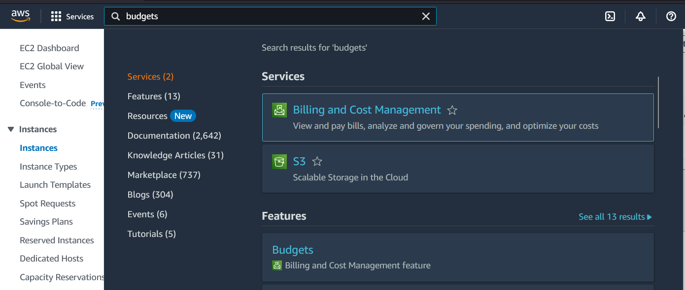
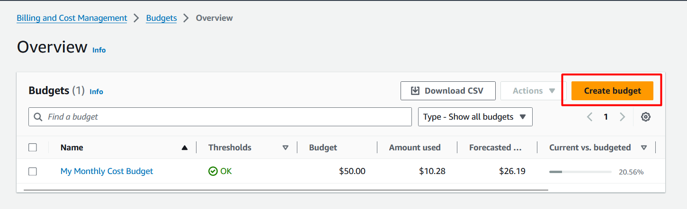
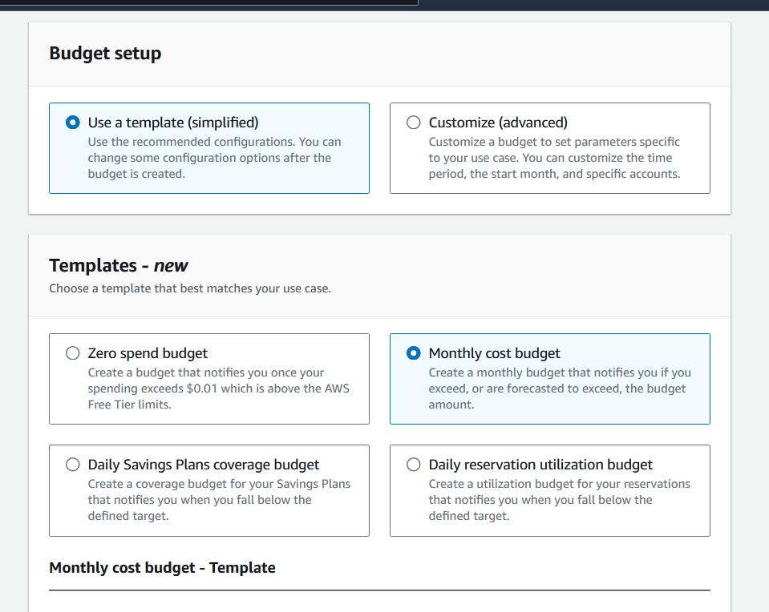
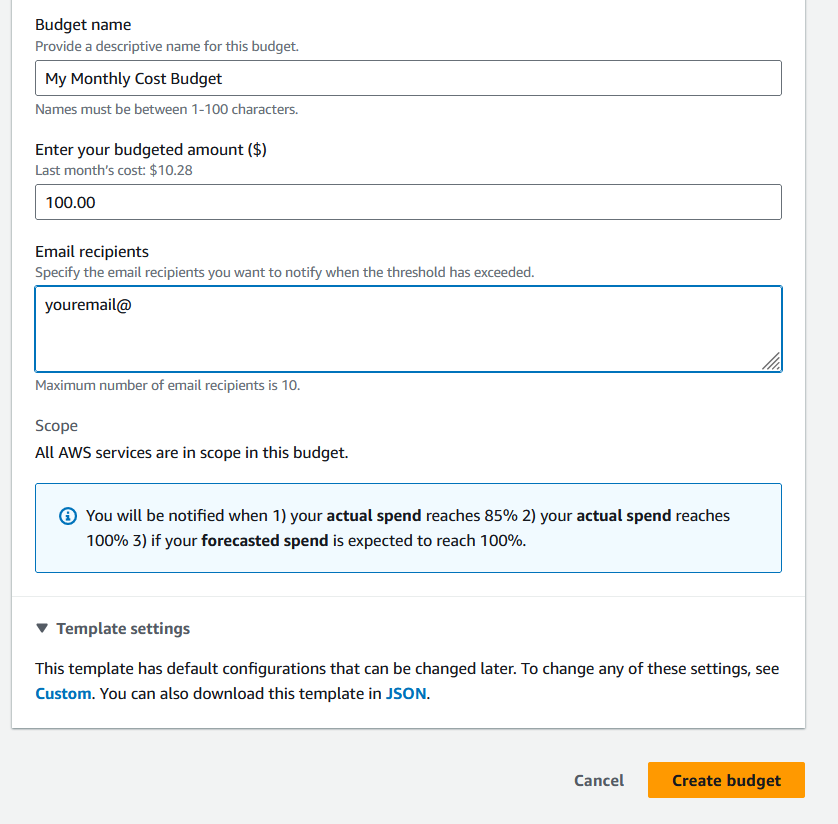

# AWS Budget Creation Guide: Monthly Cost Monitoring

## Objective
Create a monthly cost budget in AWS to monitor and control cloud spending.

## Prerequisites
- AWS Console access
- Appropriate IAM permissions for AWS Budgets
- Valid email address for notifications

## Procedure

### 1. Access AWS Budgets Service
- Log into the **AWS Management Console**
- Using the navigation bar, search for **"Budgets"**
- Select **Budgets** from the service results

### 2. Initiate Budget Creation
- From the AWS Budgets dashboard
- Click the **`Create budget`** button

### 3. Configure Budget Template
- Under **"Choose budget type"** section:
  - Select **`Use a template (simplified)`**
  - Choose **`Monthly cost budget`** template

### 4. Set Budget Parameters
| Parameter | Value | Description |
|-----------|-------|-------------|
| **Budget Name** | `My Monthly Cost Budget` | Descriptive identifier for your budget |
| **Budgeted Amount** | `100` | Monthly spending limit in USD |
| **Email Recipients** | `your@email.com` | Notification contact for budget alerts |

### 5. Finalize Configuration
- Verify all entered parameters
- Click **`Create Budget`** to deploy

## Expected Outcome
- ✅ Monthly cost budget active and monitoring
- ✅ Email notifications configured for spending alerts
- ✅ Budget tracking against $100 monthly threshold

---

## **Resources & Next Steps**

*   **📦 Full Code Repository:** [AWS Learning Labs](https://github.com/thukhakyawe/aws-learning-labs) - Get the complete, working code from this post
*   **📖 More Deep Dives:** [Whispering Cloud Insights](https://thukhakyawe.hashnode.dev/) - Read other technical articles
*   **💬 Join Discussion:** [DEV Community](https://dev.to/thukhakyawe_cloud) - Share your thoughts and questions
*   **💼 Let's Connect:** [Linkedin](www.linkedin.com/in/thukhakyawe/) - I'd love to connect with you

---