- Open the `EC2` console page from AWS Console

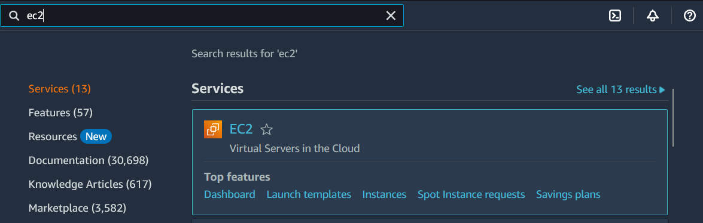

- Click on `Lifecycle Manager` on the left side menu and there is no lifecycle policies defined on the welcome screen.

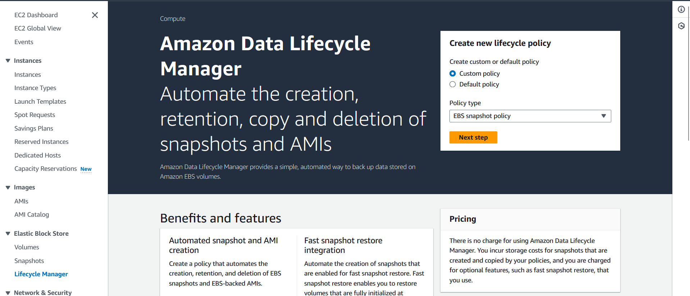

- Click on `Snapshots` on the left side menu

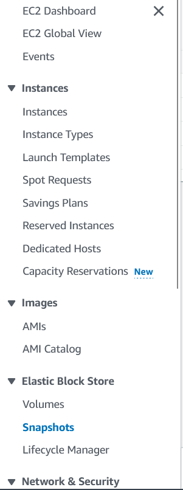

- Filter the snapshots using the "environment" tag key and you will see there is no snapshot

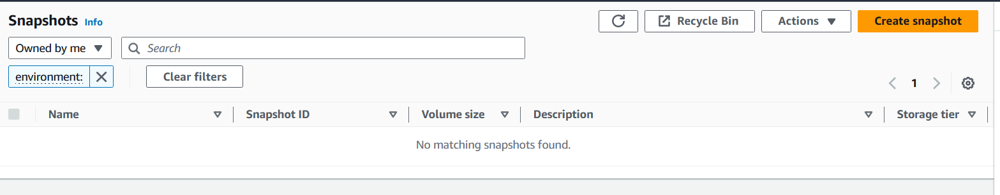

- Click on `Lifecycle Manager` on the left side menu and click `Next step`

- Click on `Target resource tags` and select `environment` and `prod` as the tag key 

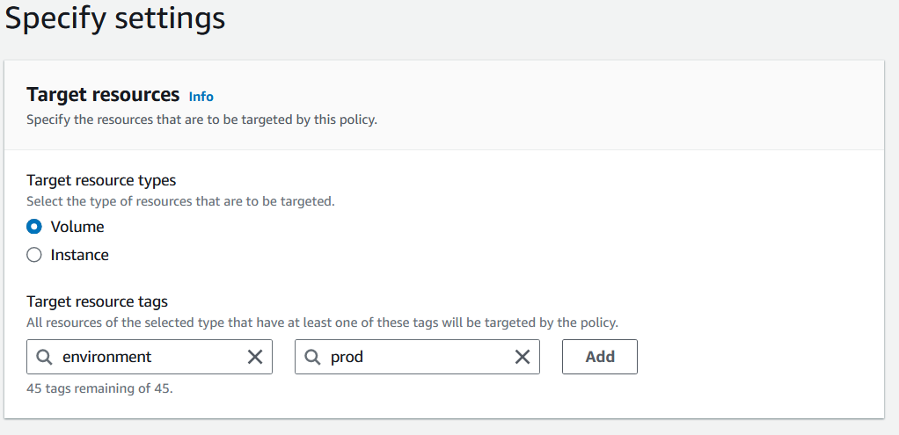

- Click `Add`

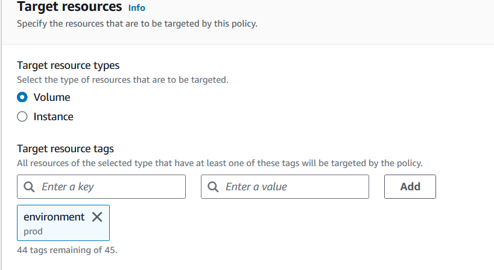

- Write prod-snapshot-policy at `Policy description`

- Select `Choose another role` and select `AWSDataLifecycleManagerDefaultRole`

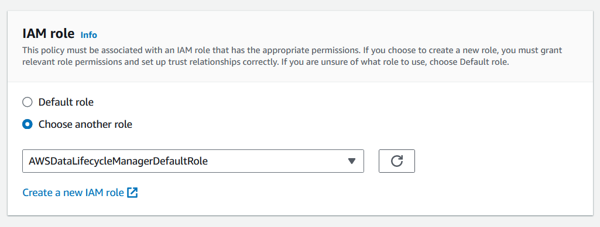

- Click `Next`

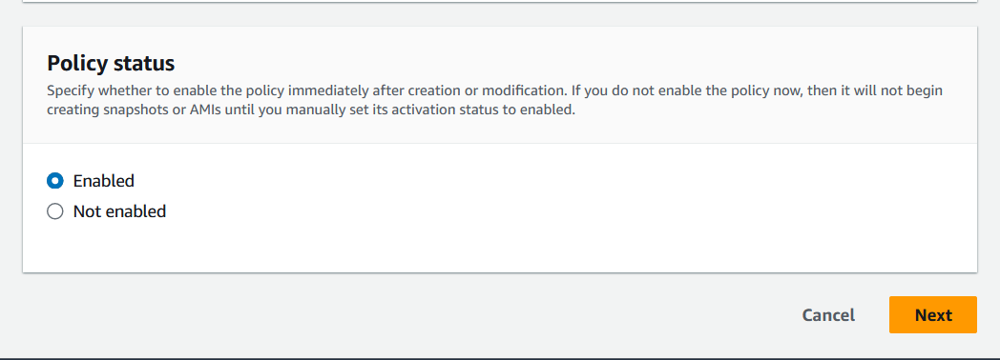

- Fill the information:

- `Schedule name`- `Schedule 1`
- `Frequency` - `Daily`
- `Every` - `1 hour`
- `Starting at` - `09:00`
- `Retention type` - `Age`
- `Expire from standard tier` - `1`
- `after creation` - `days`

and Click checkbox of `Copy tags from source`

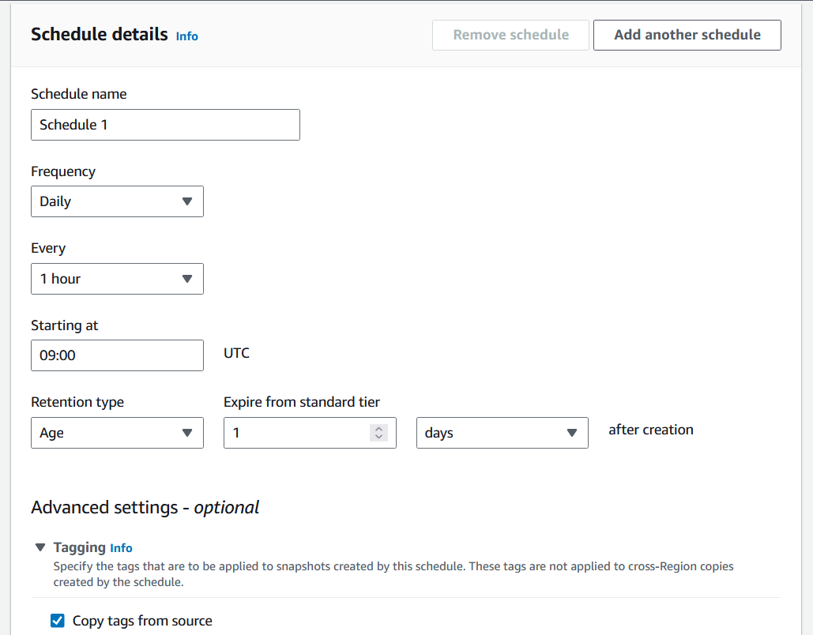

- Click `Review policy`

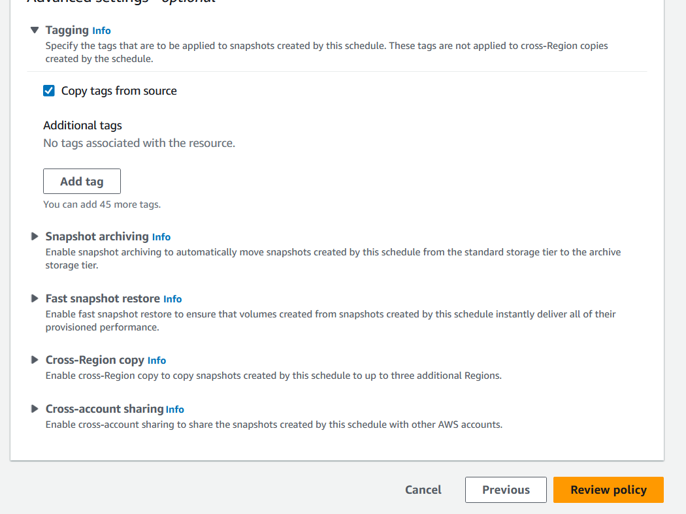

- Click Create policy`

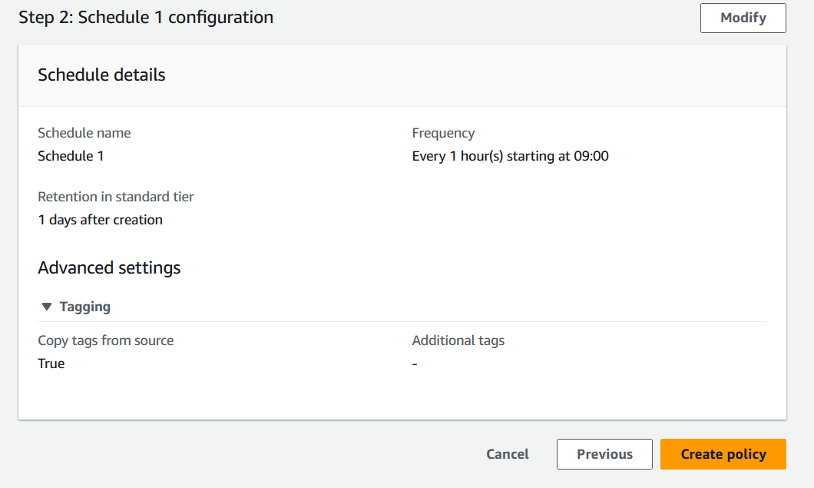

- Now The policy should be created like this

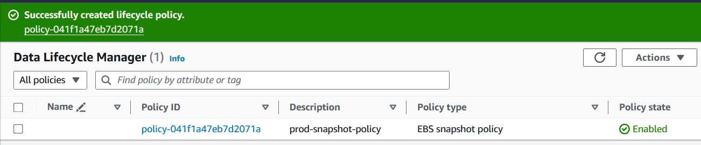

- Let create another policy for `environment:dev`

- Select `Custom policy`

- Select `EBS snapshot policy`

- Click `Next`

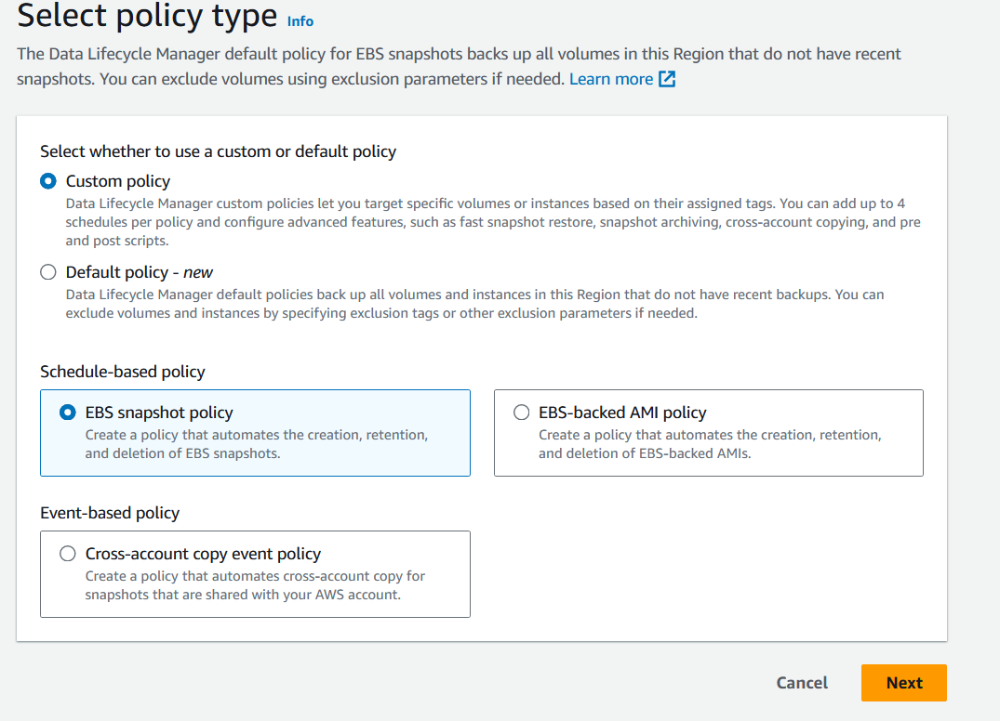

- - Click on `Target resource tags` and select `environment` and `dev` as the tag key and click `Add`

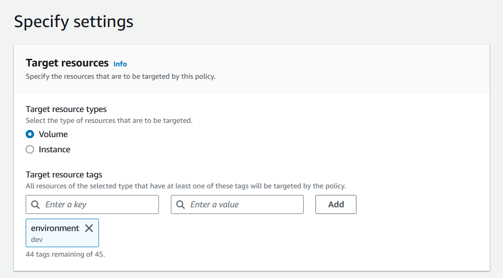

- Write dev-snapshot-policy at `Policy description`

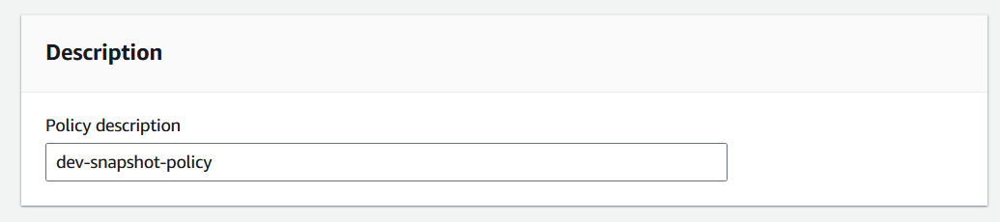

- Select `Choose another role` and select `AWSDataLifecycleManagerDefaultRole`

- Click `Next`

- Fill the information:

- `Schedule name`- `Schedule 1`
- `Frequency` - `Daily`
- `Every` - `1 hour`
- `Starting at` - `09:00`
- `Retention type` - `Age`
- `Expire from standard tier` - `1`
- `after creation` - `days`

and Click checkbox of `Copy tags from source`

- Click `Review policy`

- Click Create policy`

- Now The policy should be created like this

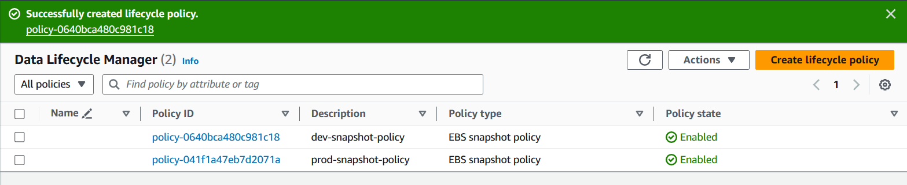

- After a couple of hours of the prod and dev snapshot policies being created, you should be able to see the first snapshots created by Lifecycle Manager. The snapshots will have a tag key dlm:managed set to a value of "true".

---

## **Resources & Next Steps**

*   **📦 Full Code Repository:** [AWS Learning Labs](https://github.com/thukhakyawe/aws-learning-labs) - Get the complete, working code from this post
*   **📖 More Deep Dives:** [Whispering Cloud Insights](https://thukhakyawe.hashnode.dev/) - Read other technical articles
*   **💬 Join Discussion:** [DEV Community](https://dev.to/thukhakyawe_cloud) - Share your thoughts and questions
*   **💼 Let's Connect:** [Linkedin](www.linkedin.com/in/thukhakyawe/) - I'd love to connect with you

---